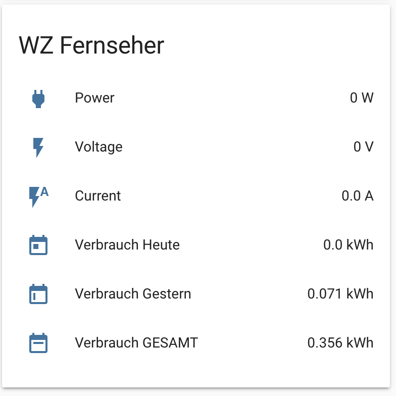

### Energy Meter Card

You can use this example to display multiple energy metering devices' readings in Home Assistant. For this to work, the devices need to run `tasmota` and have been *auto-discovered* by Home Assistant (use command `setoption19 1` in tasmota console or submit via `mqtt`).

You will need [decluttering-card](https://github.com/custom-cards/decluttering-card). Use `energy_template.yaml` as a decluttering card template, and use `energy_card.yaml` as one or multiple cards in lovelace. Don't forget to change `<name>` to each corresponding device name. (*tip*: you can *search and replace* `<name>` with the device name to save typing).

Example picture (in German language, but if you copy the code below yours will be in English)


Paste the following in your `configuration.yaml`

```
homeassistant:
  customize_glob:
    sensor.*_energy_power:
      friendly_name: Power
      icon: mdi:power-plug
    sensor.*_energy_voltage:
      friendly_name: Voltage
      icon: mdi:flash
    sensor.*_energy_current
      friendly_name: Current
      icon: mdi:flash-auto
    sensor.*_energy_today
      friendly_name: Consumption Today
      icon: mdi:calendar-today
    sensor.*_energy_yesterday:
      friendly_name: Consumption Yesterday
      icon: mdi:calendar-week-begin
    sensor.*_energy_total:
      friendly_name: Consumption Total
      icon: mdi:calendar-week
```
